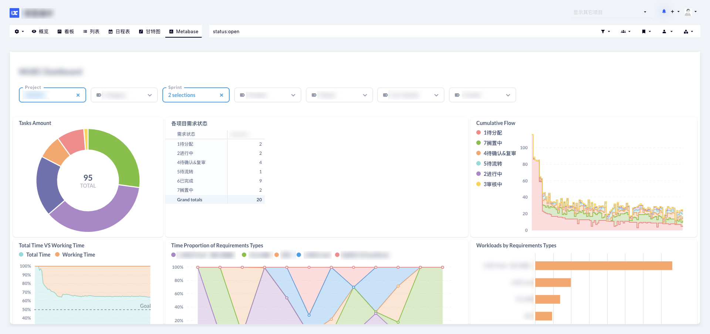

# EmbedAnything
Embed anything into [Kanboard](https://github.com/kanboard/kanboard). This plugin utilizes HTML iframes and allows you to embed any web content into your project as a stand-alone page.

## Use Case
Embed a BI tool to enhance the ability of data analytics in Kanboard.
> _Note: This is just a use case. The BI tool is not a part of EmbedAnything._

## Data forwarding
Part of the project's information can be delivered to your page by specifying the following predefined keywords in the config file: 

- `::PROJECT_ID`
- `::PROJECT_NAME`
- `::PROJECT_OWNER_ID`
- `::PROJECT_OWNER_USERNAME`
- `::PROJECT_SEARCH_QUERY` 

Static contents can also be forwarded. Check the file `config-default.php` for more information.

> ⚠️   
> Please re-edit you config file after upgrading from `0.1.0` to `0.2.0`. The configs have been changed.

## Getting started
1. Install from the Kanboard plugin manager directly. Or clone this repository to your plugin folder.
2. Copy and rename the file `config-default.php` to `config.php`, then edit it by following the instructions in the comments.

> ⚠️   
> If the embedded page is refused by your browser, please check your CSP settings on the server. References:   
> https://developer.mozilla.org/en-US/docs/Web/HTTP/Headers/Content-Security-Policy/frame-src   
> https://developer.mozilla.org/en-US/docs/Web/HTTP/Headers/Content-Security-Policy/frame-ancestors

## Author
Greyaz

## License
License MIT
